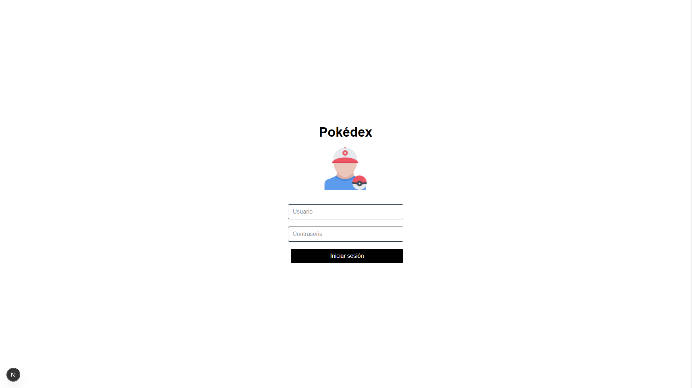
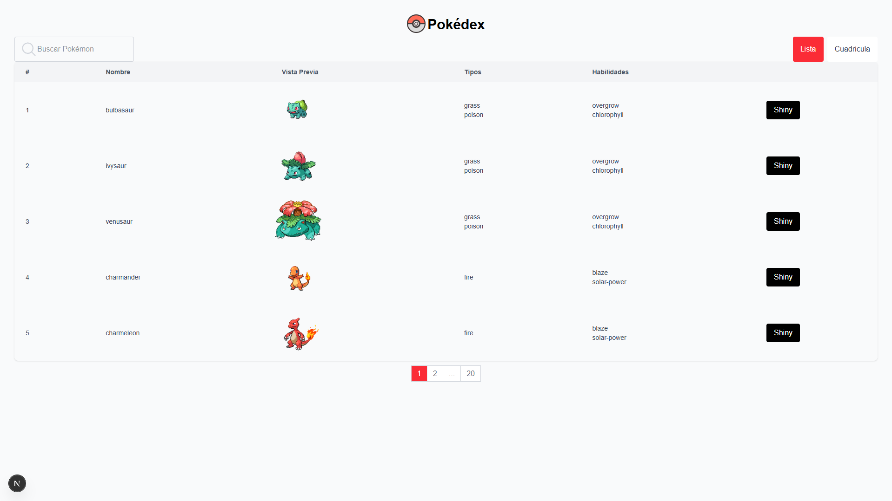
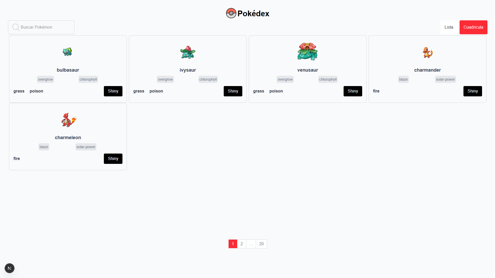
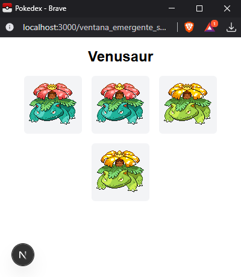
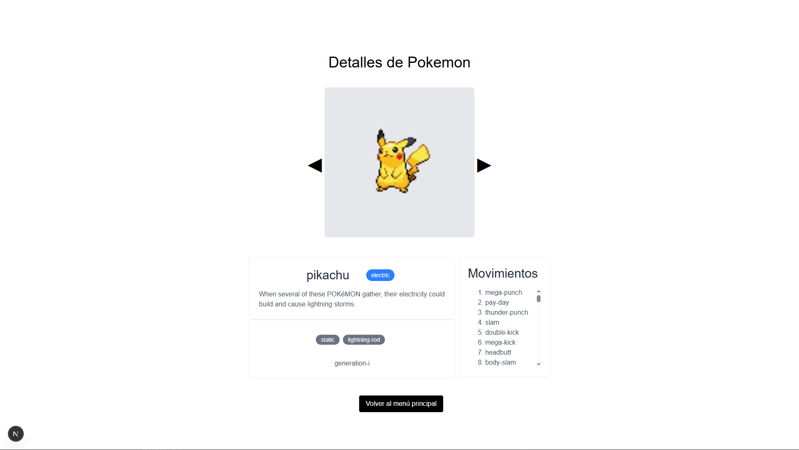

# 🧭 Pokédex

Este proyecto forma parte de mi portafolio personal y tiene como objetivo demostrar mis habilidades en **React** y **Next.js**, creando una interfaz moderna y dinámica inspirada en la Pokédex de Pokémon.  

---

## 🚀 Tecnologías Utilizadas
- ⚛️ **React** – Creación de componentes reutilizables e interfaz dinámica.  
- 💨 **Next.js** – Enrutamiento, optimización y renderizado del lado del servidor.  
- 🎨 **Tailwind CSS** – Estilos responsivos y diseño moderno.  
- 🔤 **API de PokéAPI** – Fuente de datos oficial de Pokémon.  

---

## 🖼️ Capturas de Pantalla
<p align="center">
  
  <br/>
  <em>Pantalla de Login</em>
</p>

<p align="center">
  
  <br/>
  <em>Pantalla de Inicio - Listado</em>
</p>

<p align="center">
  
  <br/>
  <em>Pantalla de Inicio - Cuadriculado</em>
</p>

<p align="center">
  
  <br/>
  <em>Pantalla de Shiny</em>
</p>

<p align="center">
  
  <br/>
  <em>Pantalla de Detalles</em>
</p>

---

## ⚙️ Instalación y Ejecución

```bash
# Clonar el repositorio
git clone https://github.com/tuusuario/pokedex.git

# Entrar al directorio del proyecto
cd pokedex

# Instalar dependencias
npm install

# Ejecutar en modo desarrollo
npm run dev

```

## 👨‍💻 Autor
Daniel Rodríguez Orozco
[LinkedIn](https://www.linkedin.com/in/danyboy910/)
[GitHub](https://github.com/DanyBoy910)
[Portafolio](https://www.artstation.com/danyboy910)
